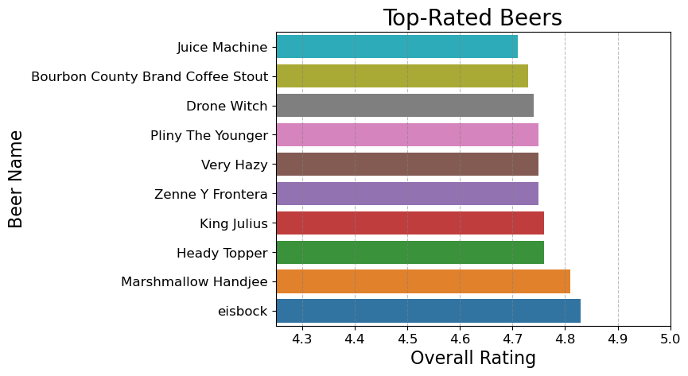
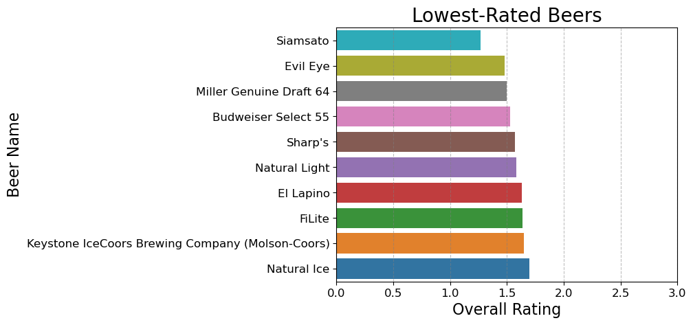
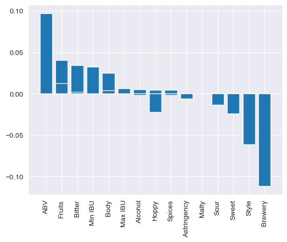
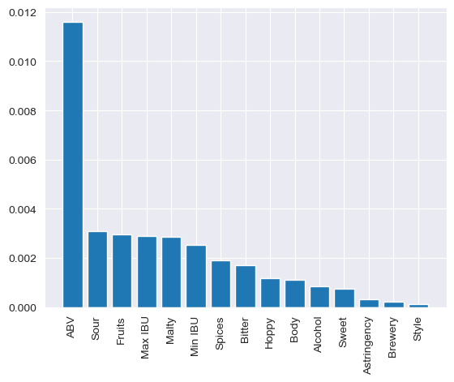

# Beer Recommender & Rating Predictor

* Student name: A. Utku Kale
* Student pace: NYC/Full time
* Scheduled project review date/time: 4/1/23
* Instructor name: Brendan Hutchinson & Joseph Mata
* Blog post URL: https://medium.com/@utkukale 


## Project Overwiev

This machine learning project is designed to help Rum & Lemonade Bistro to recommend other beers to their customers based on their preferance and help  brew their in house beer in the best way possible. The project aims to identify the most important features of beers that can help with rating prediction and popularity.

## Data

The dataset used for this machine learning project is a Beer Information - Tasting Profiles dataset obtained from Kaggle, up to 50 top-rated beers across 112 styles, 5558 beers in total. Source: BeerAdvocate.com. 


The dataset is divided into two parts. The first ten columns consist of information about the beer provided by the source, as well as additional data like a unique key for each beer and its style. The last eleven columns, on the other hand, represent the tasting profile features of the beer and are calculated based on the frequency of words used in up to 25 reviews for each beer. The assumption behind this is that people who write reviews are more likely to describe what they have experienced rather than what they have not.

The columns in the dataset are as follows:

Name: Beer's Name
\
\
Key: A unique key assigned to each beer
\
\
Style: Beer's Style
\
\
Style Key: A unique key assigned to each beer style
\
\
Brewery: Name of the beer's source
\
\
Description: Notes on the beer if available
\
\
Ave Rating: The average rating of the beer at the time of collection
\
\
Min IBU: The minimum International Bitterness Units value each beer can possess. 
\
\
Max IBU: The maximum International Bitterness Units value each beer can possess.
\
\
(Mouthfeel)
\
Astringency \
Body \
Alcohol \
\
\
(Taste) \
Bitter \
Sweet \
Sour \
Salty \
\
\
(Flavor And Aroma) \
Fruits \
Hoppy \
Spices \
Malty 
\
\
\
\
This dataset can be used to train a machine learning model to predict the average rating of a beer based on its features. The features in the dataset can also be analyzed to identify the most important ones for beer recommendations and beer rating predictions for Rum & Lemonade Bistro.


## Project steps
The data modeling process involved an exploratory data analysis phase, followed by the creation of baseline models and more advanced models using pipelines and grid searches. The performance of these models was evaluated on a hold-out test set, and the best-performing model was identified for rating prediction. Metric for this project is RMSE.

## Exploratory Data Analysis

In this chapter, I will perform a comprehensive EDA of the Beer Profiles dataset, including investigation for any duplicate or null values, summary statistics, and correlation analysis. I will explore the distribution, range, and variability of each feature, as well as their relationships with each other and the target variable "Ave Rating". The insights and observations from this EDA will help the upcoming steps in my project, such as selecting relevant features, preprocessing the data, and fine-tuning the model. This chapter will provide a comprehensive overview of the data, its characteristics, and its suitability for the genre classification task, as well as demonstrate the importance of EDA in the data science workflow.


```python

```


    (4.25, 5.0)


    

    


```python

```


    (0.0, 3.0)


    

    


Highest rated beer is Bock eisbock with 4.83 and lowest rated beer is Japanese Rice Lager Siamsoto with 1.27. Top three highest rated beer styles are IPA - New England, Stout - American Imperial and Wild Ale. 

From the EDA, there is no strong correlation between features and target. Target 'Ave Rating' is mainly distributed between 3 and 4.5 rating. Some of the features such as 'Astringency', 'Body', 'Alcohol', 'Bitter', 'Sour', 'Fruits', 'Hoppy', 'Spices' has skewness, I will use log transform to help transform their distribution to normal.For the categorical features 'Style' and 'Brewery' I will use encoder. 

I received a better score for this model. I will check feature importances to see which features affect target the most from 2 best models, LR and XGB.


```python

```


    

    


Best features are: ABV, Fruits, Bitter


```python

```


    

    


### Model Comparison
From all the models, stacked model for LR and XGB is the best model for average beer rating prediction since it has the least RMSE score.

## Beer Recommendation Systems

### Cosine Similarity

With the created function, I can recommend 5 similar beers to a given beer using cosine similarity.

### Euclidean Distance

With the created function, I can recommend 5 similar beers to a given beer using euclidean distance.

## Project Summary

This project aimed to develop a beer rating predictor and recommendation system using Beer dataset. The project included an exploratory data analysis phase, followed by the creation of baseline models and more advanced models using pipelines and grid searches. The performance of these models was evaluated on a hold-out test set, and the best-performing model was identified for genre classification.
\
\
After investigating the data, regression models were created. Five different pipelines were created with different classifiers, and hyperparameter tuning was used to improve the accuracy scores. Stacked model for XG Boost and Linear Regression was identified as the best model for beer rating prediction with a RMSE score of 0.2137.
\
\
The project also identified the best predictors for beer rating as ABV, fruitiness and bitterness. 
\
\
Finally, 2 recommendation systems were created to recommend 5 similar beers for a given beer using cosine similarity and euclidean distance. 
\
\
Overall, the project successfully developed a beer rating predictor and recommendation system that can be used by Rum & Lemonade Bistro to brew their new beer in the best way possible and provided insights into which features should be targeted to maximize profits.
